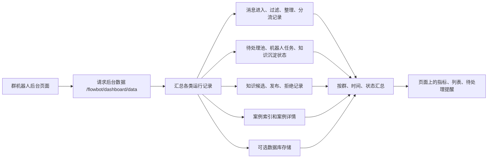
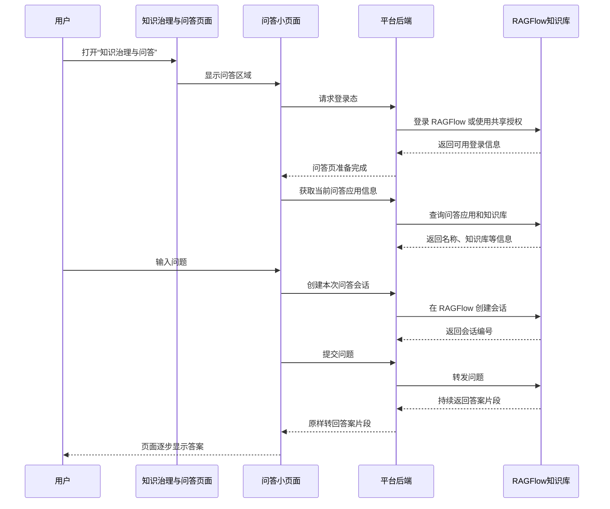
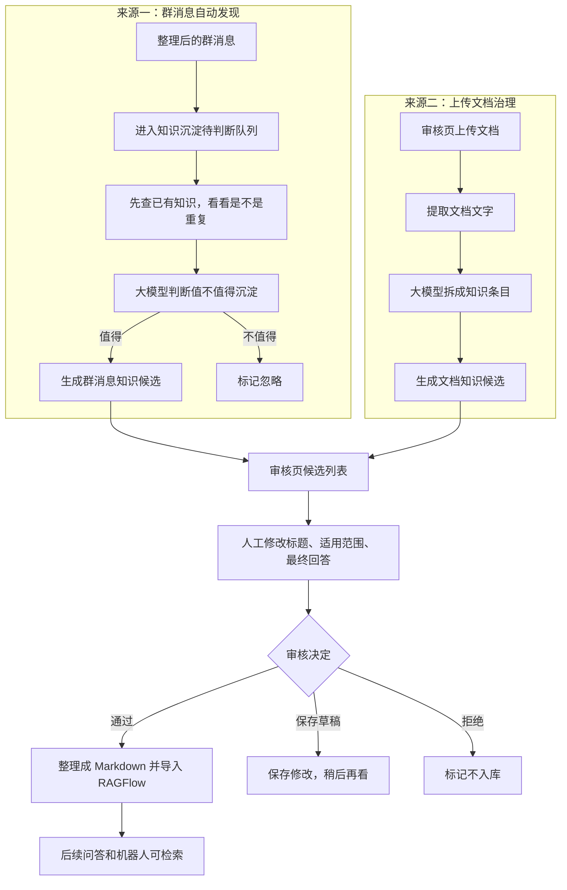
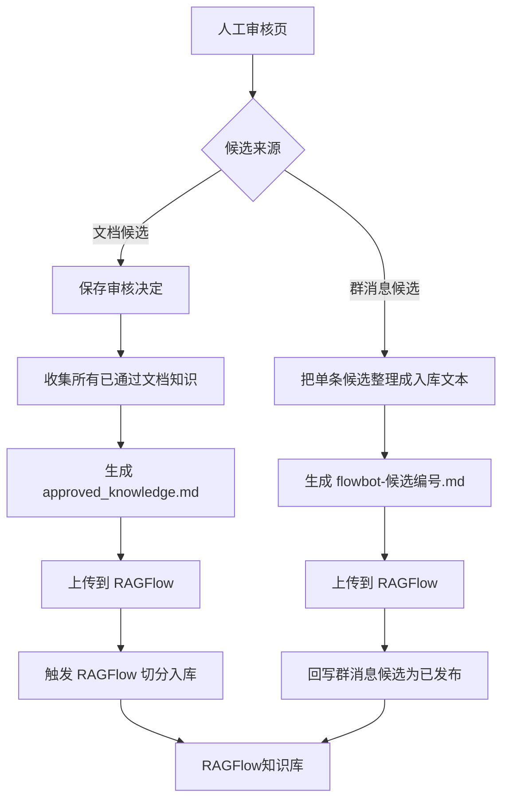
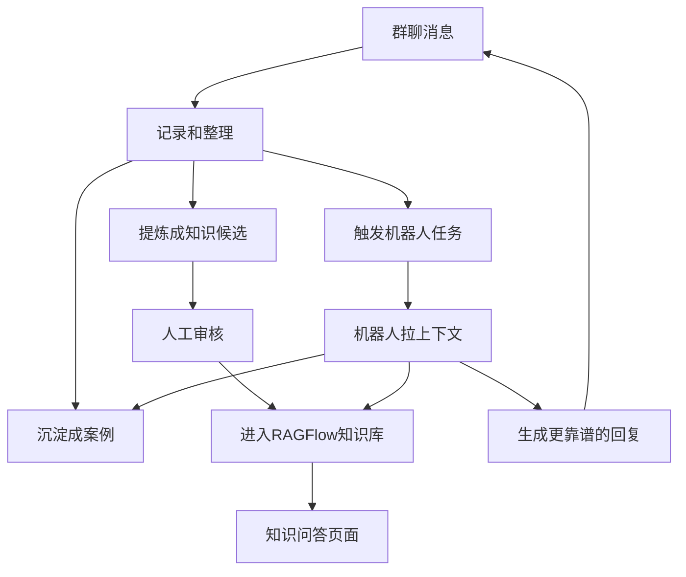
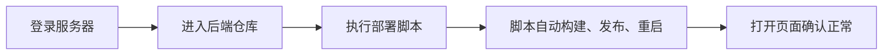

# 群机器人后台 + 知识治理与问答数据处理流程

## 1. 群消息进来以后发生什么

```mermaid
flowchart LR
  subgraph all[群消息处理总流程]
    direction LR

    wecom[企微群消息回调]
    feishu[飞书群消息回调]
    filter[先判断要不要收]
    clean[整理成统一消息格式]
    msgLog[保存统一格式群消息]
    filterLog[记录忽略原因]
    route[判断消息用途]

    caseQueue[进入自动处理队列<br/>页面叫待批处理/待处理消息]
    batch[后台定时扫描处理<br/>页面按钮可手动加速]
    groupByAi[大模型判断<br/>新建/追加/忽略/需人工看]
    archiveCase[写入案例库]
    caseStore[案例索引、详情、聊天记录]
    caseNotify[首次新建 Case 成功后<br/>发送归档通知到原群]
    ignoreMsg[标记忽略]
    needHuman[标记需要人工看]

    botQueue[进入机器人任务池]
    worker[机器人任务处理器]
    context[拉上下文<br/>群消息/案例/知识]
    answer[生成回复]
    sendBack[发回企微/飞书群]

    knowledgeQueue[登记：以后可能要不要变成知识]
    waitStable[先等一会儿<br/>避免只看半截聊天]
    harvestScan[知识沉淀扫描器定时查看]
    harvestContext[取目标消息、附近上下文<br/>和已有知识检索结果]
    harvestJudge[大模型判断]
    harvestCandidate[生成知识候选]
    reviewPage[进入知识审核页]
    ragflow[审核通过后导入 RAGFlow]
    harvestIgnore[标记忽略，不进入审核]

    wecom --> filter
    feishu --> filter
    filter -->|要收| clean --> msgLog --> route
    filter -->|不要收| filterLog

    route -->|所有有效消息| caseQueue --> batch --> groupByAi
    groupByAi -->|新建或追加| archiveCase --> caseStore
    archiveCase --> caseNotify
    groupByAi -->|没价值| ignoreMsg
    groupByAi -->|拿不准| needHuman

    route -->|命中机器人通道| botQueue --> worker --> context --> answer --> sendBack

    msgLog --> knowledgeQueue --> waitStable --> harvestScan --> harvestContext --> harvestJudge
    harvestJudge -->|有复用价值| harvestCandidate --> reviewPage --> ragflow
    harvestJudge -->|没有复用价值| harvestIgnore
  end

  classDef intake fill:#eef6ff,stroke:#8bb7e0,color:#102a43;
  classDef caseLine fill:#fff7e6,stroke:#d9a441,color:#3d2b00;
  classDef botLine fill:#eefaf1,stroke:#67b77a,color:#12351d;
  classDef knowledgeLine fill:#f4f0ff,stroke:#9b7de3,color:#241044;
  classDef muted fill:#f5f5f5,stroke:#c9c9c9,color:#333;

  class wecom,feishu,filter,clean,msgLog intake;
  class caseQueue,batch,groupByAi,archiveCase,caseStore,caseNotify caseLine;
  class botQueue,worker,context,answer,sendBack botLine;
  class knowledgeQueue,waitStable,harvestScan,harvestContext,harvestJudge,harvestCandidate,reviewPage,ragflow knowledgeLine;
  class filterLog,ignoreMsg,needHuman,harvestIgnore muted;

```



## 2. 群机器人后台页面展示的数据从哪来



## 3. 知识问答是怎么跑的



## 4. 知识候选从哪来



## 5. 审核通过后怎么入库



## 6. 群机器人和知识库怎么形成闭环



## 7. 常见名词翻译

| 文档里看到的词 | 通俗理解 |
| --- | --- |
| RAGFlow | 正式知识库和问答系统 |
| 群机器人后台 | 看群消息处理情况的总控台 |
| 知识候选 | 模型觉得“可能值得入库”的知识草稿 |
| 审核通过 | 人确认这条知识可以长期复用 |
| 拒绝 | 人确认这条不适合入库 |
| 案例 / Case | 一次客户问题或群内问题的处理记录 |
| 机器人任务 | 群里有人唤醒机器人后生成的待回复任务 |
| 消息池 | 还没处理完、等待批处理的消息集合 |
| 知识沉淀 | 从聊天或文档里提炼可复用知识 |
| 标准化消息 | 把企微、飞书不同格式的消息整理成统一格式 |
| 回写状态 | 处理完以后，把“已发布/已拒绝/失败”等结果记回去 |

## 8. 数据大概存在哪里

| 数据 | 大概位置 |
| --- | --- |
| 群消息进入、过滤、整理、分流日志 | 群机器人服务的数据目录，或数据库 |
| 待处理消息、机器人任务、知识沉淀状态 | 群机器人服务的运行状态文件，或数据库 |
| 案例索引和案例详情 | `DATA_DIR/index.json`, `DATA_DIR/thread_index.json` 以及案例详情文件 |
| 群消息知识候选 | `KNOWLEDGE_CANDIDATES_PATH` |
| 群消息知识发布/拒绝记录 | `KNOWLEDGE_PUBLISH_LOG_PATH` |
| 文档治理出来的候选 | `data/knowledge-governance/review-runs/current/governed_units.jsonl` |
| 文档审核决定 | `REVIEW_STATE_PATH` |
| 导入 RAGFlow 前生成的 Markdown | `data/knowledge-governance/review-runs/current/approved_ragflow_markdown/*.md` |
| RAGFlow 导入结果记录 | `data/knowledge-governance/review-runs/current/ragflow_import_state.json` |

## 9. 部署流程



日常部署就两行：

```bash
cd /path/to/yuebai-ai-tool-platform-server
bash scripts/deploy-linux.sh
```

部署完打开后台页面看一下能不能正常访问；如果页面打不开，再看日志：

```bash
sudo journalctl -u yuebai-ai-platform.service -f
sudo journalctl -u wecom-flowbot.service -f
sudo journalctl -u wecom-flowbot-agent-worker.service -f
```
