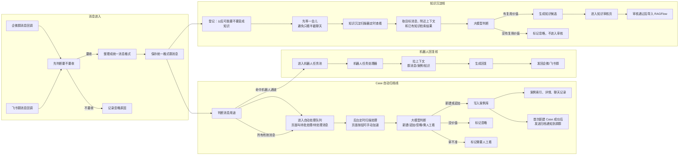
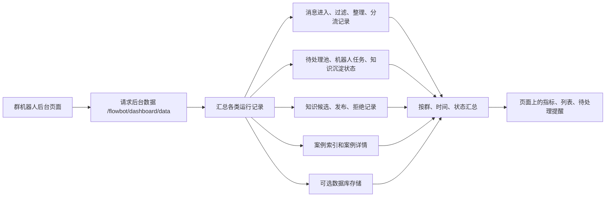
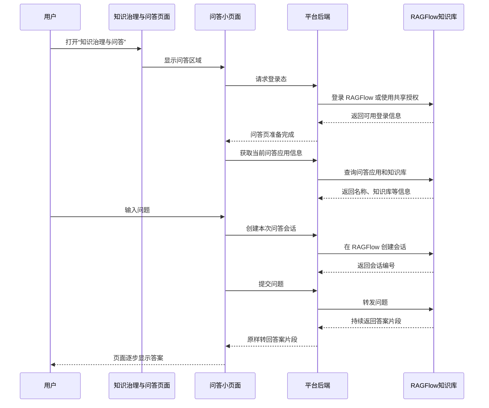
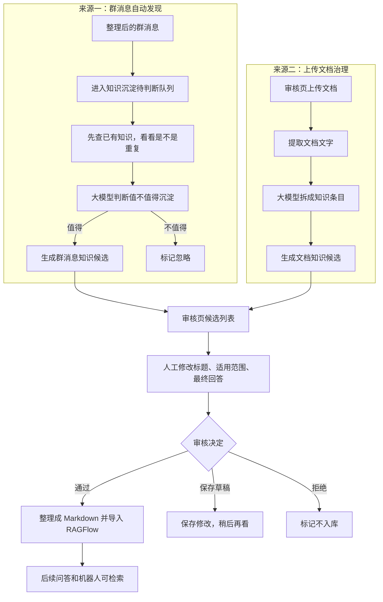
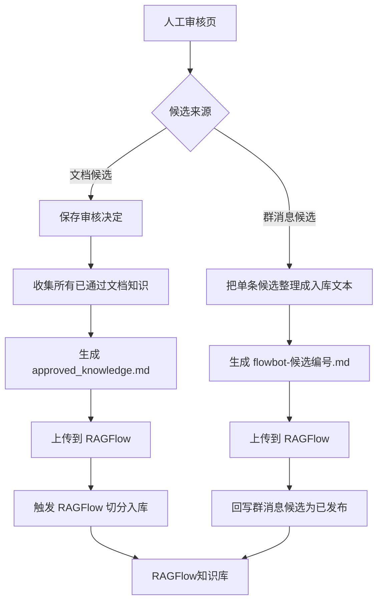
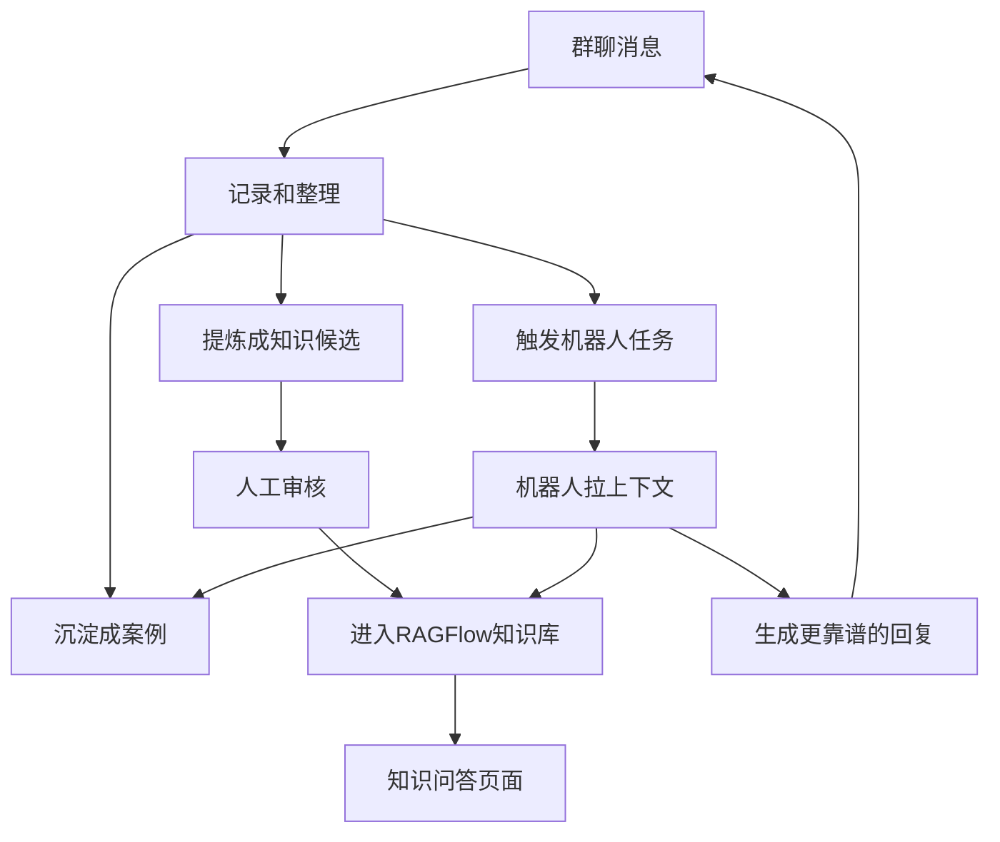
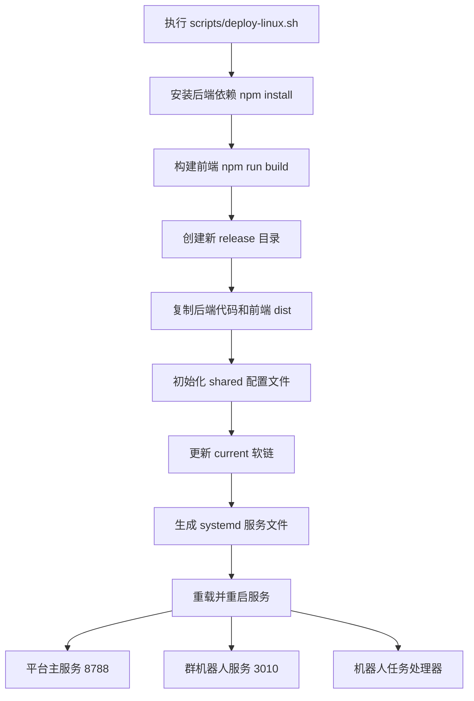
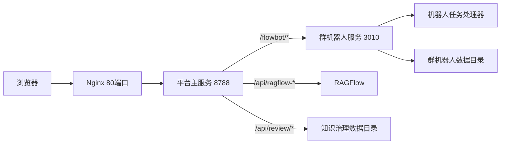

# 群机器人后台 + 知识治理与问答数据处理流程

- **群机器人后台**：主要看“群消息有没有进来、哪些被过滤、哪些变成了工单/案例、哪些触发机器人回复、哪些沉淀成知识候选”。
- **知识治理与问答**：主要做两件事，一是用 RAGFlow 问知识库，二是审核“可沉淀进知识库”的候选内容。
- 两个页面不是割裂的。群机器人后台会从群聊里捞出“可能值得沉淀”的内容，送到知识审核；审核通过后进入 RAGFlow，后面机器人和人工问答都能用上。

## 1. 群消息进来以后发生什么



这条链路可以按“收、筛、分、办、记”来理解：

1. **收**：企微和飞书把群消息推给后端。
2. **筛**：系统先过滤掉不支持的消息、自己发的消息、不在白名单的群消息。
3. **整理并留底**：不同来源的消息字段不一样，系统会统一成一种内部格式，然后保存下来。这个记录主要用于后台展示、后续检索、机器人拉上下文、案例归档取原始消息。
4. **顺手登记知识判断**：保存消息时，系统会顺手把“看起来有文字内容的消息”登记到知识沉淀队列。这里还不是入库，也不是候选，只是排队等后面判断：这段聊天有没有可复用的解决办法、规则或操作步骤。
5. **分流**：有效消息都会进入案例/工单自动处理队列；如果消息命中机器人通道，还会进入机器人回复任务池。
6. **办事**：
   - 案例/工单自动处理队列：后台会定时扫描待处理消息，大模型把一批消息分组，判断是新建案例、追加到已有案例、忽略，还是少数情况需要人工看。
   - 机器人任务池：任务处理器拉取群上下文、历史案例和知识库内容，再生成回复。
7. **归档通知**：如果这批消息被判断为“新建 Case”，并且 Case 首次创建成功，同时归档推送开关开启，系统会把归档结果通知发回原群，通常会带上归档摘要和看板链接。
8. **记录**：每一步都会写日志或状态，后台页面就是读这些记录后展示出来。

对应到页面上：

- 还没被自动扫描到时：在群机器人后台的 **Case 归档** 页签里，主要对应 **待处理消息** 这个列表；顶部流程指标里也会显示为 **待批处理**。
- 正常处理方式：后台服务定时自动扫描并处理，不需要人在页面上逐条点。
- 页面按钮的作用：**立即处理待处理** 和 **处理待处理** 是加速/补救用的手动触发，不是主流程必需步骤。
- 处理完以后：如果成案，会进入 **已归纳为 Case**；如果没成案，会进入 **未归纳成 Case 的数据** 或相关候选进度区域。
- 如果是首次新建 Case，并且 **Case 归档推送** 开关开启，系统还会自动把归档通知发回原群；如果只是追加到已有 Case，当前逻辑一般不发群通知。

“知识沉淀待判断”和“Case 归档”不是一回事：

- **Case 归档看的是这件事要不要形成处理记录**：有没有客户问题、异常反馈、跟进进度，应该新建 Case、追加 Case、忽略，还是暂时看不准。
- **知识沉淀看的是这段聊天以后能不能复用**：有没有明确结论、处理步骤、故障原因、配置说明、产品规则、排查路径。
- 两条线从同一份群消息出发，但并行处理，互不等对方结果。代码里的知识沉淀提示词也明确要求：只根据标准化群消息判断，不依赖 Case 归档结果。
- 例子：  
  “客户说登录失败，麻烦看下”适合进 Case，但通常不是知识。  
  “登录失败是因为账号被锁，后台解锁后让客户重新登录即可”才可能变成知识候选。

知识沉淀“什么时候看”：

- 消息先被保存成统一格式。
- 如果这条消息有足够文字内容，并且所在群允许做知识沉淀，就登记为待判断。
- 后台定时扫描这批待判断消息，默认大约每 60 秒扫一次；消息默认至少沉淀 2 分钟后再判断，避免只看半截聊天。
- 判断时会拿目标消息、附近几条上下文、已有知识检索结果一起给大模型看。
- 大模型只做初筛：输出“忽略”或“生成知识候选”。真正入库还要走人工审核。

知识沉淀这条支线继续往下是：

1. **先排队**：只要消息有足够文字内容，并且不是纯图片、视频、文件、语音、表情提示，就先进入待判断队列。
2. **等聊天稳定**：默认不会立刻判断，会等一小段时间。这样如果后面有人补了一句“原因是 xxx，按 xxx 处理”，模型能一起看到。
3. **取上下文**：判断时不只看单条消息，还会取同一个群里它前后几条消息。
4. **查已有知识**：系统会先搜索当前知识库，看看是不是已经有类似内容。
5. **让大模型判断**：
   - 没有明确结论、只是报障/闲聊/追问：忽略。
   - 有明确处理办法、规则、步骤、排查路径：生成知识候选。
   - 像已有知识但有补充：也可以生成候选，标记为“可能更新已有知识”。
6. **进入审核页**：生成候选后，会出现在“知识治理与问答”的知识候选审核里，由人决定通过、修改、拒绝。
7. **审核通过才入库**：通过后才会整理成 Markdown 导入 RAGFlow，后续问答和机器人才能检索使用。

代码定位：

- 消息入口：`apps/flowbot-bridge/lib/callback_routes.js`
- 消息分流：`apps/flowbot-bridge/lib/agent_route_service.js`
- 案例批处理：`apps/flowbot-bridge/lib/batch_processor_service.js`
- Case 归档通知：`apps/flowbot-bridge/lib/archive_notification_service.js`
- 机器人任务接口：`apps/flowbot-bridge/lib/agent_api_routes.js`

当前机器人唤醒机制：

- 先看总开关：`FLOWBOT_AGENT_LANE_ENABLED`，默认开启。关掉后，即使消息里有唤醒词，也不会进入机器人任务池。
- 唤醒名来自 `FLOWBOT_AGENT_WAKE_NAMES`，默认是 `小智`，可以配置多个，用英文逗号分隔。
- 系统会检查消息正文、引用内容、标题、描述里是否包含这些唤醒名。代码会统一转小写后再比对，所以英文大小写不敏感；中文基本就是按原字匹配。
- 如果消息是明确 @ 机器人，也会触发。这里有两种判断：
  - `at_list` 里包含当前接收机器人 ID，也就是直接 @ 到机器人账号。
  - 文本里出现 `@小智`，或者 `at_list` 里能匹配到配置的唤醒名。
- 只要命中上面任意一种，并且机器人通道开关是开的，这条消息就会额外生成机器人任务。
- 生成机器人任务不影响 Case 归档。当前逻辑下，有效消息仍然会走 Case 自动处理；命中机器人时只是多走一条机器人回复线，所以路由状态叫“双通道”。

需要注意：

- 现在的“名字唤醒”比较宽松：正文里只要包含配置的名字，比如“小智”，就可能触发，不一定必须带 `@`。
- 如果想减少误触发，可以把唤醒名配置得更明确，或者后续把规则改成必须 `@名字` / 必须 at 机器人 ID。

## 2. 群机器人后台页面展示的数据从哪来



这里容易误会：群机器人后台不是查一张表。

它会把很多地方的数据拼起来：

- 哪些消息进来了。
- 哪些消息被忽略了，为什么忽略。
- 哪些消息整理成统一格式了。
- 哪些消息进入案例池、机器人任务池。
- 哪些案例创建成功、追加成功、失败。
- 哪些群消息被识别成知识候选。
- 哪些知识候选已发布、被拒绝、还在等审核。

所以后台上的“待处理”“最新消息”“知识候选”“案例进展”都是汇总结果，不是单一接口原样展示。

主要实现：`apps/flowbot-bridge/lib/dashboard_data_service.js`

## 3. 知识问答是怎么跑的



通俗理解：

- 平台自己不负责“想答案”，真正回答的是 RAGFlow。
- 平台做的是“帮你登录 RAGFlow、创建会话、把问题转过去、把答案流式转回来”。
- RAGFlow 能答什么，取决于知识库里已经导入了什么内容。

主要实现：

- 问答桥接页：`public/ragflow-workbench-bridge.html`
- 问答轻量页面：`public/ragflow-chat-proxy.html`
- RAGFlow 代理服务：`lib/ragflow_service.js`

## 4. 知识候选从哪来

知识候选有两条来源：

1. **群消息里自动发现**：比如群里有人问了问题，后面又有人给出明确解决办法，这种内容可能适合沉淀成知识。
2. **人工上传文档治理**：把飞书文档、Markdown、Word、PDF 等内容上传，让大模型拆成一条条可审核知识。



群消息候选流程说人话：

- 系统不会把所有群消息都塞进知识库。
- 它会先等消息稳定一点，再拿目标消息和附近上下文一起给大模型判断。
- 判断前还会查一遍已有知识，看看这条内容是全新知识、已有知识的补充，还是重复内容。
- 如果值得沉淀，就生成“知识候选”，状态是“待审核”。

文档候选流程说人话：

- 用户在审核页上传文件。
- 后端先把文件里的文字提出来。
- 大模型把长文档拆成多条“可问答”的知识。
- 每条知识都要带证据、适用范围、可对外回复内容、内部说明、是否需要人工审核。

主要实现：

- 群消息知识发现：`apps/flowbot-bridge/lib/knowledge_harvest_service.js`
- 文档上传治理：`lib/knowledge_governance_service.js`
- 审核页面：`src/workbenches/KnowledgeWorkbench.jsx`

## 5. 审核通过后怎么入库



两种候选通过后的区别：

- **文档候选**：通常是批量导入，把所有已经审核通过的文档知识合成一个 Markdown 文件，再导入 RAGFlow。
- **群消息候选**：通常是单条导入，每审核通过一条，就生成一个对应的 Markdown 文件导入 RAGFlow，并回写这条候选“已发布”。

为什么要人工审核：

- 群聊里可能有口语、上下文缺失、临时方案，不一定适合直接进知识库。
- 文档里可能有内部信息、账号、配置、敏感内容，不一定能对外回答。
- 审核环节就是把“模型整理出来的草稿”变成“公司愿意长期复用的知识”。

主要实现：

- 文档候选审核和导入：`lib/knowledge_routes.js`, `lib/knowledge_review_service.js`, `lib/ragflow_service.js`
- 群消息候选审核和导入：`lib/knowledge_routes.js`, `lib/flowbot_candidates_service.js`, `apps/flowbot-bridge/lib/agent_api_routes.js`

## 6. 群机器人和知识库怎么形成闭环



这就是整个系统最核心的循环：

1. 群里每天产生真实问题。
2. 系统把真实问题整理成案例和知识候选。
3. 人审核后，靠谱的内容进入知识库。
4. 后面再有人问类似问题，机器人和 RAGFlow 都能用这批知识回答。
5. 新问题继续进入下一轮沉淀。

一句话：**群聊是原料，审核是质检，RAGFlow 是正式知识库，机器人和问答页是消费知识的地方。**

## 7. 常见名词翻译

| 文档里看到的词 | 通俗理解 |
| --- | --- |
| RAGFlow | 正式知识库和问答系统 |
| 群机器人后台 | 看群消息处理情况的总控台 |
| 知识候选 | 模型觉得“可能值得入库”的知识草稿 |
| 审核通过 | 人确认这条知识可以长期复用 |
| 拒绝 | 人确认这条不适合入库 |
| 案例 / Case | 一次客户问题或群内问题的处理记录 |
| 机器人任务 | 群里有人唤醒机器人后生成的待回复任务 |
| 消息池 | 还没处理完、等待批处理的消息集合 |
| 知识沉淀 | 从聊天或文档里提炼可复用知识 |
| 标准化消息 | 把企微、飞书不同格式的消息整理成统一格式 |
| 回写状态 | 处理完以后，把“已发布/已拒绝/失败”等结果记回去 |

## 8. 关键接口和代码位置

| 你想查什么 | 看哪里 |
| --- | --- |
| 平台菜单怎么来的 | `GET /api/modules`，实现看 `server.js` 和 `lib/platform_proxy_service.js` |
| 群机器人后台页面 | `/flowbot/dashboard`，实现看 `apps/flowbot-bridge/lib/bridge_management_routes.js` |
| 群机器人后台统计数据 | `/flowbot/dashboard/data`，实现看 `apps/flowbot-bridge/lib/dashboard_data_service.js` |
| 企微/飞书消息怎么进来 | `/flowbot/callback`, `/feishu/callback`，实现看 `apps/flowbot-bridge/lib/callback_routes.js` |
| 消息怎么分流到案例或机器人 | `apps/flowbot-bridge/lib/agent_route_service.js` |
| 案例批处理怎么做 | `apps/flowbot-bridge/lib/batch_processor_service.js` |
| 机器人回复怎么发 | `/flowbot/agent/reply`，实现看 `apps/flowbot-bridge/lib/agent_api_routes.js` |
| 群消息怎么变成知识候选 | `/flowbot/knowledge-harvest/process`，实现看 `apps/flowbot-bridge/lib/knowledge_harvest_service.js` |
| 审核页怎么读群消息候选 | `/api/flowbot/knowledge-candidates`，实现看 `lib/knowledge_routes.js` 和 `lib/flowbot_candidates_service.js` |
| 审核页怎么读文档候选 | `/api/review/items`，实现看 `lib/knowledge_routes.js` 和 `lib/knowledge_review_service.js` |
| 上传文档后怎么治理 | `/api/review/upload`，实现看 `lib/knowledge_governance_service.js` |
| 审核通过后怎么入 RAGFlow | `/api/review/import-ragflow`，实现看 `lib/ragflow_service.js` |
| 问答页怎么问 RAGFlow | `/api/ragflow-chat-*`，实现看 `lib/ragflow_service.js` |

## 9. 数据大概存在哪里

| 数据 | 大概位置 |
| --- | --- |
| 群消息进入、过滤、整理、分流日志 | 群机器人服务的数据目录，或数据库 |
| 待处理消息、机器人任务、知识沉淀状态 | 群机器人服务的运行状态文件，或数据库 |
| 案例索引和案例详情 | `DATA_DIR/index.json`, `DATA_DIR/thread_index.json` 以及案例详情文件 |
| 群消息知识候选 | `KNOWLEDGE_CANDIDATES_PATH` |
| 群消息知识发布/拒绝记录 | `KNOWLEDGE_PUBLISH_LOG_PATH` |
| 文档治理出来的候选 | `data/knowledge-governance/review-runs/current/governed_units.jsonl` |
| 文档审核决定 | `REVIEW_STATE_PATH` |
| 导入 RAGFlow 前生成的 Markdown | `data/knowledge-governance/review-runs/current/approved_ragflow_markdown/*.md` |
| RAGFlow 导入结果记录 | `data/knowledge-governance/review-runs/current/ragflow_import_state.json` |

## 10. 部署流程

这个项目线上不是只起一个服务，和这两个页面相关的主要有三块：

- **平台主服务**：提供主页面、菜单、知识审核接口、RAGFlow 问答代理，默认端口 `8788`。
- **群机器人服务**：接企微/飞书回调，做消息整理、Case 自动归档、知识候选发现，默认端口 `3010`。
- **机器人任务处理器**：专门拉取机器人任务，生成回复并发回群里。

部署脚本入口：

```bash
cd /path/to/yuebai-ai-tool-platform-server
bash scripts/deploy-linux.sh
```

### 10.1 部署脚本做了什么



脚本主要动作：

1. 在后端仓库执行 `npm install`。
2. 找到前端仓库并执行 `npm install && npm run build`。
3. 在 `/opt/yuebai-ai-platform/releases/时间戳` 下创建新版本。
4. 把后端代码和前端 `dist` 拷进新版本。
5. 把配置文件放到 `/opt/yuebai-ai-platform/shared`，如果已经存在就不覆盖。
6. 把 `/opt/yuebai-ai-platform/current` 指向新版本。
7. 安装或更新 systemd 服务。
8. 重启平台主服务、群机器人服务、机器人任务处理器。

### 10.2 关键目录

| 目录 | 用途 |
| --- | --- |
| `/opt/yuebai-ai-platform/current` | 当前正在运行的代码版本 |
| `/opt/yuebai-ai-platform/releases/*` | 每次部署生成一个版本目录 |
| `/opt/yuebai-ai-platform/shared` | 线上配置，不随发版覆盖 |
| `/opt/yuebai-ai-platform/data/customer-bot-data` | 群机器人运行数据 |
| `/opt/yuebai-ai-platform/data/knowledge-governance` | 文档治理和审核数据 |

### 10.3 关键配置

部署时会从示例配置初始化这些文件：

| 配置文件 | 作用 |
| --- | --- |
| `/opt/yuebai-ai-platform/shared/ai-admin.json` | 平台主服务配置 |
| `/opt/yuebai-ai-platform/shared/flowbot.json` | 群机器人服务配置 |
| `/opt/yuebai-ai-platform/shared/content-assets.json` | 内容资产服务配置 |
| `/opt/yuebai-ai-platform/shared/intel-api.json` | AI 搜索服务配置 |
| `/opt/yuebai-ai-platform/shared/.env` | 兼容旧环境变量和统一环境配置 |

和这两个页面最相关的是：

- `FLOWBOT_BASE_URL`：平台主服务访问群机器人服务的地址，通常是 `http://127.0.0.1:3010`。
- `FLOWBOT_DATA_DIR`：群机器人数据目录。
- `FLOWBOT_KNOWLEDGE_DIR`：本地知识文件目录。
- `RAGFLOW_BASE_URL`：RAGFlow 服务地址。
- `RAGFLOW_AGENT_ID`：RAGFlow 问答应用 ID。
- `RAGFLOW_LOGIN_EMAIL / RAGFLOW_LOGIN_PASSWORD / RAGFLOW_SHARE_AUTH`：RAGFlow 登录或共享授权。
- `REVIEW_RUN_DIR`：知识治理审核数据目录。

### 10.4 systemd 服务

| 服务 | 做什么 | 启动脚本 |
| --- | --- | --- |
| `yuebai-ai-platform.service` | 平台主服务，主页面、知识审核、RAGFlow 代理 | `scripts/dev-ai-admin.sh` |
| `wecom-flowbot.service` | 群机器人服务，接收回调、自动归档、知识沉淀 | `scripts/prod-flowbot.sh` |
| `wecom-flowbot-agent-worker.service` | 机器人任务处理器，拉任务并回复群聊 | `scripts/prod-flowbot-worker.sh` |

常用命令：

```bash
sudo systemctl status yuebai-ai-platform.service
sudo systemctl status wecom-flowbot.service
sudo systemctl status wecom-flowbot-agent-worker.service

sudo journalctl -u yuebai-ai-platform.service -f
sudo journalctl -u wecom-flowbot.service -f
sudo journalctl -u wecom-flowbot-agent-worker.service -f
```

### 10.5 请求流向



说明：

- 浏览器通常访问 Nginx。
- Nginx 把所有请求转到平台主服务 `8788`。
- 平台主服务遇到 `/flowbot/*` 会转给群机器人服务 `3010`。
- RAGFlow 问答和知识入库由平台主服务代理到 RAGFlow。
- 群机器人服务和 worker 之间通过 `/flowbot/agent/*` 接口配合。

### 10.6 部署后检查

部署完成后，至少检查这几项：

```bash
curl http://127.0.0.1:8788/api/health
curl "http://127.0.0.1:3010/flowbot/dashboard/data?limit=1"
```

页面上检查：

- 打开平台主页面，看左侧是否有“群机器人后台”和“知识治理与问答”。
- 打开群机器人后台，看是否能加载群列表、待批处理、Case、知识候选等数据。
- 打开知识治理与问答，看 RAGFlow 问答是否能初始化。
- 切到知识候选审核，看群消息候选和文档候选是否能正常加载。

如果群机器人后台打不开，优先看：

```bash
sudo journalctl -u wecom-flowbot.service -f
```

如果知识问答打不开，优先看：

```bash
sudo journalctl -u yuebai-ai-platform.service -f
```

再确认 `RAGFLOW_BASE_URL`、登录信息、`RAGFLOW_AGENT_ID` 是否配置正确。
