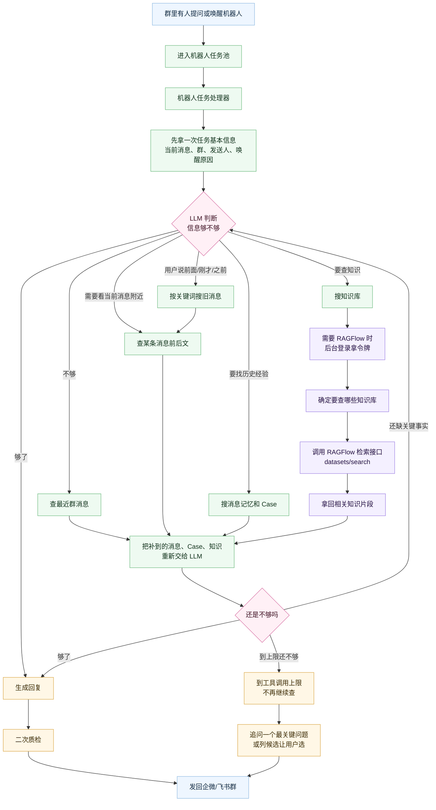
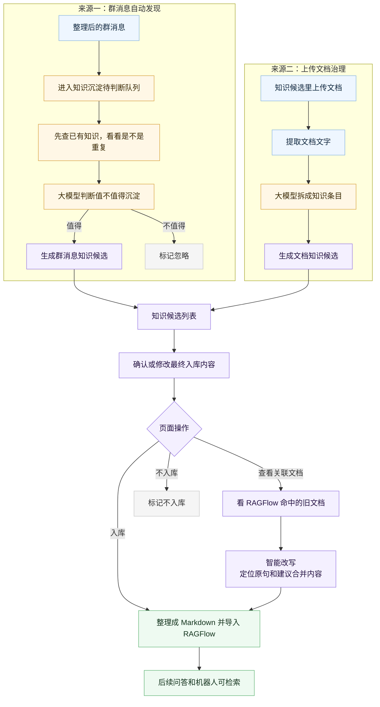
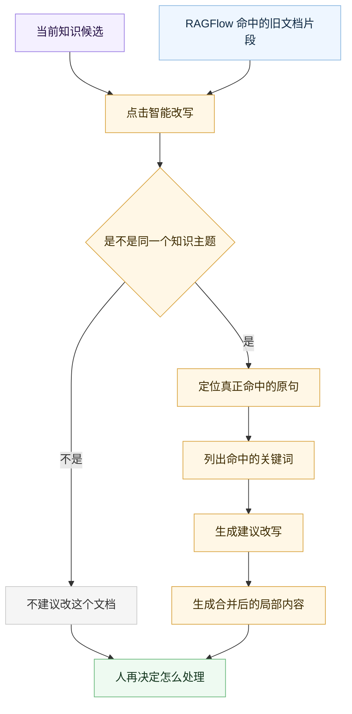

# 群机器人后台 + 知识治理与问答数据处理流程

## 1. 常见名词翻译

| 文档里看到的词 | 通俗理解 |
| --- | --- |
| RAGFlow | 正式知识库和问答系统 |
| 群机器人后台 | 看群消息处理情况的总控台 |
| 知识候选 | 模型觉得“可能值得入库”的知识草稿 |
| 入 RAGFlow | 人确认这条知识可以长期复用，并同步到 RAGFlow |
| 不入库 | 人确认这条不适合进知识库 |
| 案例 / Case | 一次客户问题或群内问题的处理记录 |
| 机器人任务 | 群里有人唤醒机器人后生成的待回复任务 |
| 消息池 | 还没处理完、等待批处理的消息集合 |
| 知识沉淀 | 从聊天或文档里提炼可复用知识 |
| 标准化消息 | 把企微、飞书不同格式的消息整理成统一格式 |
| 回写状态 | 处理完以后，把“已入库/不入库/失败”等结果记回去 |

## 2. 群消息进来以后发生什么

```mermaid
flowchart LR
  subgraph all[群消息处理总流程]
    direction LR

    wecom[企微群消息回调]
    feishu[飞书群消息回调]
    filter[先判断要不要收]
    clean[整理成统一消息格式]
    msgLog[保存统一格式群消息]
    filterLog[记录忽略原因]
    route[判断消息用途]

    caseQueue[进入自动处理队列<br/>页面叫待批处理/待处理消息]
    batch[后台定时扫描处理<br/>页面按钮可手动加速]
    groupByAi[大模型判断<br/>新建/追加/忽略/需人工看]
    archiveCase[写入案例库]
    caseStore[案例索引、详情、聊天记录]
    caseNotify[首次新建 Case 成功后<br/>发送归档通知到原群]
    ignoreMsg[标记忽略]
    needHuman[标记需要人工看]

    botQueue[进入机器人任务池]
    worker[机器人任务处理器]
    context[拉上下文<br/>群消息/案例/知识]
    answer[生成回复]
    sendBack[发回企微/飞书群]

    knowledgeQueue[登记：以后可能要不要变成知识]
    waitStable[先等一会儿<br/>避免只看半截聊天]
    harvestScan[知识沉淀扫描器定时查看]
    harvestContext[取目标消息、附近上下文<br/>和已有知识检索结果]
    harvestJudge[大模型判断]
    harvestCandidate[生成知识候选]
    reviewPage[进入知识候选]
    ragflow[点入 RAGFlow 后同步]
    harvestIgnore[标记忽略，不进入审核]

    wecom --> filter
    feishu --> filter
    filter -->|要收| clean --> msgLog --> route
    filter -->|不要收| filterLog

    route -->|所有有效消息| caseQueue --> batch --> groupByAi
    groupByAi -->|新建或追加| archiveCase --> caseStore
    archiveCase --> caseNotify
    groupByAi -->|没价值| ignoreMsg
    groupByAi -->|拿不准| needHuman

    route -->|命中机器人通道| botQueue --> worker --> context --> answer --> sendBack

    msgLog --> knowledgeQueue --> waitStable --> harvestScan --> harvestContext --> harvestJudge
    harvestJudge -->|有复用价值| harvestCandidate --> reviewPage --> ragflow
    harvestJudge -->|没有复用价值| harvestIgnore
  end

  classDef intake fill:#eef6ff,stroke:#8bb7e0,color:#102a43;
  classDef caseLine fill:#fff7e6,stroke:#d9a441,color:#3d2b00;
  classDef botLine fill:#eefaf1,stroke:#67b77a,color:#12351d;
  classDef knowledgeLine fill:#f4f0ff,stroke:#9b7de3,color:#241044;
  classDef muted fill:#f5f5f5,stroke:#c9c9c9,color:#333;

  class wecom,feishu,filter,clean,msgLog intake;
  class caseQueue,batch,groupByAi,archiveCase,caseStore,caseNotify caseLine;
  class botQueue,worker,context,answer,sendBack botLine;
  class knowledgeQueue,waitStable,harvestScan,harvestContext,harvestJudge,harvestCandidate,reviewPage,ragflow knowledgeLine;
  class filterLog,ignoreMsg,needHuman,harvestIgnore muted;

```



## 3. RAGFlow 检索是怎么跑的



## 4. 知识候选从哪来



点「入 RAGFlow」后，真正喂进 RAGFlow 的不是原始聊天记录，也不是整篇文档原文，而是整理后的 Markdown。

这里有个坑：RAGFlow 会把 Markdown 里的文字都当成可检索内容。像「最终入库内容：」「原文证据：」「置信度：」「可见性：」这种审核字段，如果也写进 Markdown，就可能被检索出来，最后出现在机器人回复里。

所以入库 Markdown 应该少放“治理字段”，多放“业务问题和答案”。推荐长这样：

```markdown
# 后台登录失败如何处理

## 常见问法
- 客户进不去后台怎么办？
- 登录提示账号异常怎么处理？
- 后台账号被锁定了怎么处理？

## 答案
如果客户反馈进不去后台，先确认账号是否被锁定、密码是否连续输错、当前登录入口是否正确。

如果是账号锁定，先让客户等待锁定时间结束；如仍无法登录，再收集账号、店铺名、报错截图交给技术排查。

## 关键词
登录、后台、账号锁定、登录失败、账号异常
```

这里不是说「常见问法」「答案」这些标题完全不会被搜到。它们也在 Markdown 里，也可能进入切片。只是它们是业务结构标题，污染很小，还能帮助切片更清楚。真正不该进 RAGFlow 正文的是审核过程里的字段，比如「最终入库内容」「原文证据」「审核备注」。

简单记：

| 内容 | 要不要进 RAGFlow 正文 | 原因 |
| --- | --- | --- |
| 业务标题 | 要 | 帮助检索知道这段讲什么 |
| 用户可能怎么问 | 要 | 用户真实提问更容易命中 |
| 标准答案 | 要 | 机器人最终主要引用这部分 |
| 关键词/别名 | 要 | 产品名、错误码、俗称更容易搜到 |
| 原文证据 | 不建议 | 容易把原始聊天、半截话、审核痕迹带进回复 |
| 置信度、可见性、审核备注 | 不要 | 这是给人审核用的，不是给用户回答用的 |

证据不是不要，而是应该留在系统记录里，方便人追溯；不要把它当答案正文喂给 RAGFlow。

### 已有知识、误召回和智能改写

知识候选页现在有三个核心动作：

| 按钮 | 什么时候点 | 结果 |
| --- | --- | --- |
| 入库 | 确认这是新知识，或者关联文档都不适合改 | 作为一条新的 Markdown 知识导入 RAGFlow |
| 查看关联文档 | 想看 RAGFlow 认为它像哪些旧知识 | 展示命中的旧文档、命中片段和智能改写结果 |
| 不入库 | 这条消息不适合沉淀 | 标记不入库 |

这里最容易误会的是“关联文档”。RAGFlow 返回的是“相关片段”，不是“准确告诉我们该改哪一句”。它可能只是因为都有“云发单”这几个字，就把不太相关的文档找出来。

比如用户问：

```text
云发单续费支持不支持开发票？
```

RAGFlow 可能命中：

```text
云发单支持平台列表
```

这不代表“平台列表”这个文档应该被改。它只是被召回了，需要再判断。

所以我们加了“智能改写”：



智能改写会给人看四块内容：

| 区域 | 作用 |
| --- | --- |
| 原文 | RAGFlow 命中的旧片段 |
| 命中的原句 | LLM 从旧片段里找出的真正相关句子 |
| 建议改写 | 这句话应该怎么改或怎么补 |
| 合并后的内容 | 把旧片段和新知识合在一起后，局部 Markdown 应该长什么样 |

判断规则可以简单理解成：

| 情况 | 怎么处理 |
| --- | --- |
| 没有关联文档 | 直接入库 |
| 有关联文档，但全部“不建议改写” | 说明是误召回，直接入库 |
| 有文档能定位到原句，并生成合并内容 | 人看完后再决定是否做后续覆盖 |

当前页面先做“看清楚”和“生成建议”，不会自动把整篇旧 md 覆盖掉。因为一个 md 里可能有很多条知识，直接覆盖整篇会误删别的知识。真正覆盖时，应该只替换相关小段。

## 5. RAGFlow 是什么

RAGFlow 可以理解成“正式知识库 + 问答引擎”。它解决的是：公司自己的文档、群聊经验、处理规则，大模型本来不知道；RAGFlow 先把这些资料存成可检索的知识，提问时先找资料，再让大模型基于资料回答。

### 市面上常见的知识库工具

| 工具 | 更像什么 | 适合什么场景 |
| --- | --- | --- |
| Dify | AI 应用搭建平台 | 想快速搭应用、工作流、智能体、RAG 都放在一个平台里 |
| FastGPT | 知识库问答 + 可视化编排 | 想快速做知识库问答，也想拖拽编排流程 |
| MaxKB | 轻量知识库问答系统 | 想更简单地搭内部知识库、客服问答 |
| AnythingLLM | 本地知识库聊天工具 | 个人或小团队想快速本地跑起来 |
| LangChain / LlamaIndex | 开发框架 | 技术团队想完全自己写检索、切片、向量库、问答逻辑 |
| RAGFlow | 文档理解能力更重的 RAG 引擎 | 文档格式复杂、想重点做好解析、切片、检索和引用 |

我们选择 RAGFlow，主要不是因为它“能聊天”，而是因为它更贴近我们这里的需求：

- 我们已经有自己的业务页面、群机器人、人工审核流程，不需要再用一个大平台重做应用编排。
- 我们真正缺的是一个稳定的“正式知识库底座”，负责接收 Markdown、切片、建索引、检索。
- 我们有飞书文档、群消息沉淀、人工整理后的 Markdown，后面还可能有更多复杂文档，RAGFlow 对文档解析和 RAG 检索这块更专注。
- 我们的机器人是在代码内部调用 RAGFlow 检索，不是把业务流程都搬到 RAGFlow 里做。

### 检索为什么能找出来

RAGFlow 不是只靠“拆词”。它更像“搜索引擎 + 向量检索 + 大模型回答”。RAGFlow 默认用 Elasticsearch 存全文和向量，也可以切到 Infinity。

| 检索方式 | 适合解决什么 |
| --- | --- |
| 关键词检索 | 产品名、错误码、接口名、固定术语等字面对得上的内容 |
| 向量检索 | “说法不同，但意思接近”的内容 |

关键词检索类似倒排索引：

| 词 | 出现在哪些片段里 |
| --- | --- |
| 登录失败 | 片段 1、片段 7 |
| 账号锁定 | 片段 7、片段 12 |
| 解锁 | 片段 7、片段 18 |

这样问“登录失败是不是账号锁了”，系统很快能找到片段 7。

但用户可能问“客户进不去后台”，文档写的是“登录失败”。这时光靠关键词不够，就要用向量检索。

### 向量是什么

向量就是一串数字。向量化模型会把一句话变成数字，让机器能比较“意思像不像”。

```text
登录失败怎么办      -> [0.12, 0.88, 0.41, ...]
客户进不去后台      -> [0.14, 0.86, 0.39, ...]
怎么设置优惠券      -> [0.73, 0.21, 0.66, ...]
```

前两句意思接近，所以向量距离更近；第三句是另一个话题，距离更远。

这里分工是：

| 角色 | 做什么 |
| --- | --- |
| 向量化模型 | 把文字变成向量 |
| 检索引擎 | 保存向量，计算哪个片段更接近问题 |
| 回答大模型 | 拿到片段后，组织成自然语言回答 |

向量化模型不是人工写规则，它是训练出来的。训练时会让相似句子的向量更近，不相关句子的向量更远。比如“登录失败怎么办”和“客户进不去后台”被拉近，“登录失败怎么办”和“怎么设置优惠券”被拉远。

容易误会的点：

| 误会 | 实际情况 |
| --- | --- |
| 上传文档就一定答得好 | 还要看文档质量、切片效果、问题是否清楚 |
| RAGFlow 自动知道所有公司事情 | 只有导进去的资料，它才方便检索 |
| 群消息会直接进知识库 | 不会，先生成候选，点「入 RAGFlow」后才入库 |
| 知识库能替代 Case | 不能。Case 是一次处理记录，知识库是可复用经验 |

### 用 Ollama 本地跑向量模型

如果不想用云厂商的向量模型，也可以把开源向量模型下载到本机，用 Ollama 跑起来，再让 RAGFlow 调它。

本机先下载模型：

```bash
ollama pull qwen3-embedding:0.6b
```

测试模型能不能把文字变成向量：

```bash
curl http://127.0.0.1:11434/api/embed \
  -H "Content-Type: application/json" \
  -d '{
    "model": "qwen3-embedding:0.6b",
    "input": [
      "后台登录失败怎么办",
      "客户进不去后台怎么处理",
      "怎么设置优惠券"
    ]
  }'
```

在 RAGFlow 里添加模型：

```text
模型提供商
  ↓
Ollama
  ↓
Base URL：http://127.0.0.1:11434
  ↓
API-Key：dummy
  ↓
添加模型：qwen3-embedding:0.6b
  ↓
模型类型：Embedding
  ↓
最大 token 数：8192
```

然后新建一个测试知识库，在知识库配置里把 `Embedding` 选成 `qwen3-embedding:0.6b`，再上传 Markdown 测试。

注意：如果 RAGFlow 在服务器上，`127.0.0.1` 指的是服务器自己，不是你的电脑。这种情况下要么把 Ollama 也装到服务器，要么把本机 Ollama 暴露成服务器能访问的地址。

参考资料：

- [RAGFlow 官方 Quickstart](https://ragflow.io/docs/)
- [RAGFlow GitHub README](https://github.com/infiniflow/ragflow)
- [MTEB 向量模型排行榜](https://huggingface.co/spaces/mteb/leaderboard)

## 6. 部署流程

平台部署：

```bash
cd /path/to/yuebai-ai-tool-platform-server
bash scripts/deploy-linux.sh
```

检查平台服务：

```bash
curl http://127.0.0.1:8788/api/health
curl "http://127.0.0.1:3010/flowbot/dashboard/data?limit=1"
```

看日志：

```bash
sudo journalctl -u yuebai-ai-platform.service -f
sudo journalctl -u wecom-flowbot.service -f
sudo journalctl -u wecom-flowbot-agent-worker.service -f
```

MySQL 安装：

```bash
sudo apt update
sudo apt install -y mysql-server
sudo systemctl enable --now mysql

sudo mysql -e "CREATE DATABASE IF NOT EXISTS flowbot_runtime DEFAULT CHARACTER SET utf8mb4 COLLATE utf8mb4_0900_ai_ci;"
sudo mysql -e "CREATE USER IF NOT EXISTS 'flowbot_app'@'%' IDENTIFIED BY '请改成强密码';"
sudo mysql -e "GRANT ALL PRIVILEGES ON flowbot_runtime.* TO 'flowbot_app'@'%'; FLUSH PRIVILEGES;"
```

平台连接 MySQL：

打开「群机器人后台」里的「设置 / 运行配置」，在「数据存储」里填：

- 存储方式：`mysql`
- MySQL 地址：`127.0.0.1`
- MySQL 端口：`3306`
- 数据库名：`flowbot_runtime`
- 用户名：`flowbot_app`
- 密码：上面创建用户时填的密码
- 自动建表：打开

保存后重启群机器人服务：

```bash
sudo systemctl restart wecom-flowbot.service
sudo systemctl restart wecom-flowbot-agent-worker.service
```

RAGFlow 安装：

```bash
sudo sysctl -w vm.max_map_count=262144
echo "vm.max_map_count=262144" | sudo tee -a /etc/sysctl.conf

cd /opt
git clone https://github.com/infiniflow/ragflow.git
cd /opt/ragflow/docker
docker compose -f docker-compose.yml up -d
docker compose -f docker-compose.yml ps
docker compose -f docker-compose.yml logs -f
```

平台连接 RAGFlow：

打开「知识治理与问答」，点「RAGFlow 设置」，填：

- RAGFlow 服务地址：`http://127.0.0.1:8080`
- 问答入口：`http://127.0.0.1:8080/yuebai-workbench/`
- 问答应用 ID：RAGFlow 里的聊天应用 ID
- 知识库数据集 ID：RAGFlow 里的数据集 ID
- API Token：RAGFlow 里生成的 API token

保存后重启平台服务：

```bash
sudo systemctl restart yuebai-ai-platform.service
```
